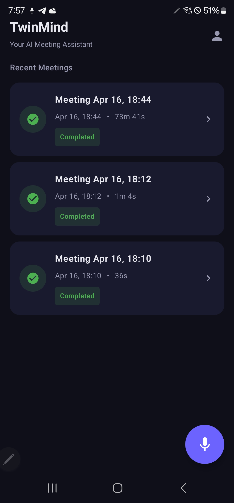
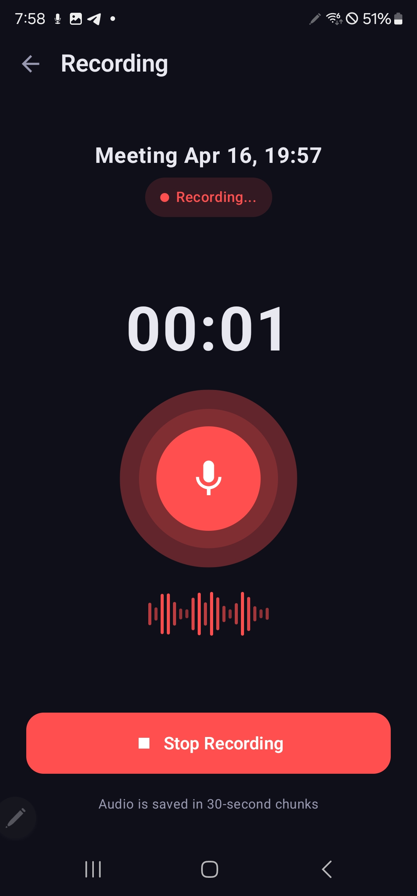
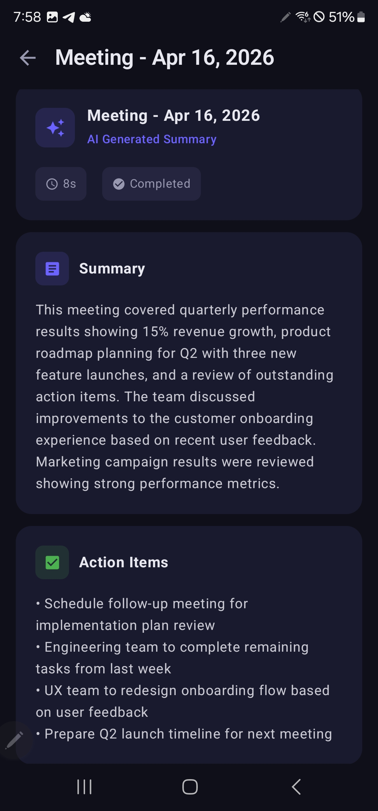

# TwinMind Android App

A voice recording app with transcription and summary generation built with Kotlin, Jetpack Compose, MVVM, and Hilt.

## 📸 Screenshots

| Dashboard                                  | Recording                                   | Summary                                   |
|--------------------------------------------|---------------------------------------------|-------------------------------------------|
|  |  |  |

## Features Implemented

### ✅ Core Features
- **Dashboard** - Lists all recorded sessions with status indicators
- **Foreground Recording Service** - Records audio in background with persistent notification and Stop button
- **30-second Audio Chunking** - Automatically splits recording into chunks with 2-second overlap
- **Room Database** - All sessions and chunks persisted locally (single source of truth)
- **Background Transcription Worker** - Mock transcription with retry logic (up to 3 attempts)
- **Background Summary Worker** - Mock summary generation that survives app kill
- **Summary Screen** - Shows Title, Summary, Action Items, Key Points with loading/error states
- **Retry Button** - Retry summary generation on failure
- **Clean MVVM + Hilt Architecture**

### ✅ Edge Cases Handled

| Edge Case | Implementation |
|-----------|----------------|
| **Phone call interruption** | `TelephonyCallback` (API 31+) / `PhoneStateListener` (legacy) — pauses on `CALL_STATE_RINGING` or `OFFHOOK`, resumes on `CALL_STATE_IDLE` |
| **Audio focus loss** | `AudioManager.OnAudioFocusChangeListener` — pauses on `AUDIOFOCUS_LOSS` / `AUDIOFOCUS_LOSS_TRANSIENT`, resumes on `AUDIOFOCUS_GAIN`; shows Resume button in notification |
| **Wired & Bluetooth headset changes** | `BroadcastReceiver` on `ACTION_HEADSET_PLUG` and `ACTION_SCO_AUDIO_STATE_UPDATED` — recording continues uninterrupted, UI notified |
| **Low storage** | `StatFs` checked before start and every 10s during recording — stops session if free space drops below 50 MB |
| **Process death recovery** | Session status persisted as `RECORDING` in Room; `RecoveryWorker` re-enqueues untranscribed chunks on boot or app restart via `BootReceiver` |
| **Silent audio detection** | `MediaRecorder.maxAmplitude` polled after 10s — shows microphone warning if amplitude is zero |
| **2-second chunk overlap** | Each chunk rotates at 28s so the next chunk starts 2s before the previous ends, preserving speech continuity at boundaries |

### Tech Stack
- Kotlin + Jetpack Compose
- MVVM: ViewModel → Repository → DAO
- Hilt (Dependency Injection)
- Room (Local Database)
- WorkManager (Background jobs)
- Coroutines + Flow
- Retrofit (configured, mock used)

## Remaining / Future Work

| Item | Notes |
|------|-------|
| Real Whisper/Gemini API | Replace mock in `TranscriptionWorker` with actual API call |
| Android 16 Lock Screen Live Updates | `LiveActivityManager` / `OngoingActivity` API |

## Setup

1. Clone the repo
2. Open in Android Studio Hedgehog or newer
3. Run on device/emulator with API 24+
4. Grant microphone and notification permissions when prompted

> **Note:** `READ_PHONE_STATE` permission is required in `AndroidManifest.xml` for call interruption handling.

## Architecture Diagram

```
MainActivity
    └── NavHost
        ├── DashboardScreen ← DashboardViewModel ← RecordingRepository
        ├── RecordingScreen ← RecordingViewModel ← RecordingRepository
        └── SummaryScreen   ← SummaryViewModel   ← RecordingRepository
                                                        ├── SessionDao (Room)
                                                        └── AudioChunkDao (Room)

RecordingService (Foreground)
    ├── PhoneStateListener / TelephonyCallback  → pause/resume on calls
    ├── AudioFocusRequest                       → pause/resume on focus loss
    ├── BroadcastReceiver (headset)             → notify on mic source change
    ├── StatFs storage monitor (every 10s)      → stop on low storage
    ├── Silence detector (maxAmplitude @ 10s)   → warn if mic is dead
    └── Saves chunks every 28s → enqueues TranscriptionWorker

TranscriptionWorker (WorkManager)
    └── On all chunks done → enqueues SummaryWorker

SummaryWorker (WorkManager)
    └── Updates session with summary in Room

BootReceiver / RecoveryWorker
    └── On boot/restart → finds RECORDING sessions → re-enqueues transcription
```